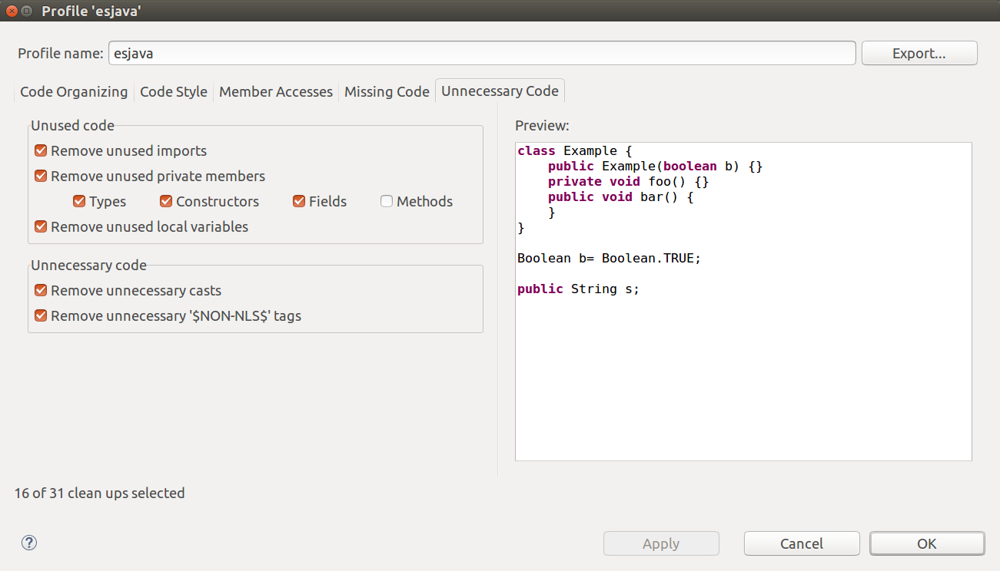

# JavaScript Snowball Stemmers [](https://travis-ci.org/mazko/jssnowball)

Port from [Snowball](http://snowball.tartarus.org/) Stemmers. [Online](http://mazko.github.io/jssnowball/)

### ESJava (ES6) fan

- [Run](snowball_cache/configure) to download and regenerate last original Java Snowball stemmers

- There are many unused code / methods in *.java src like ```copy_from```, ```hashCode``` e.t.c use your favorite IDE to remove. Here is Eclipse EE Mars.1 Release (4.5.1) example:

*source -> cleanup*

{:style="width:100%; border:1px solid #ddd;"}

